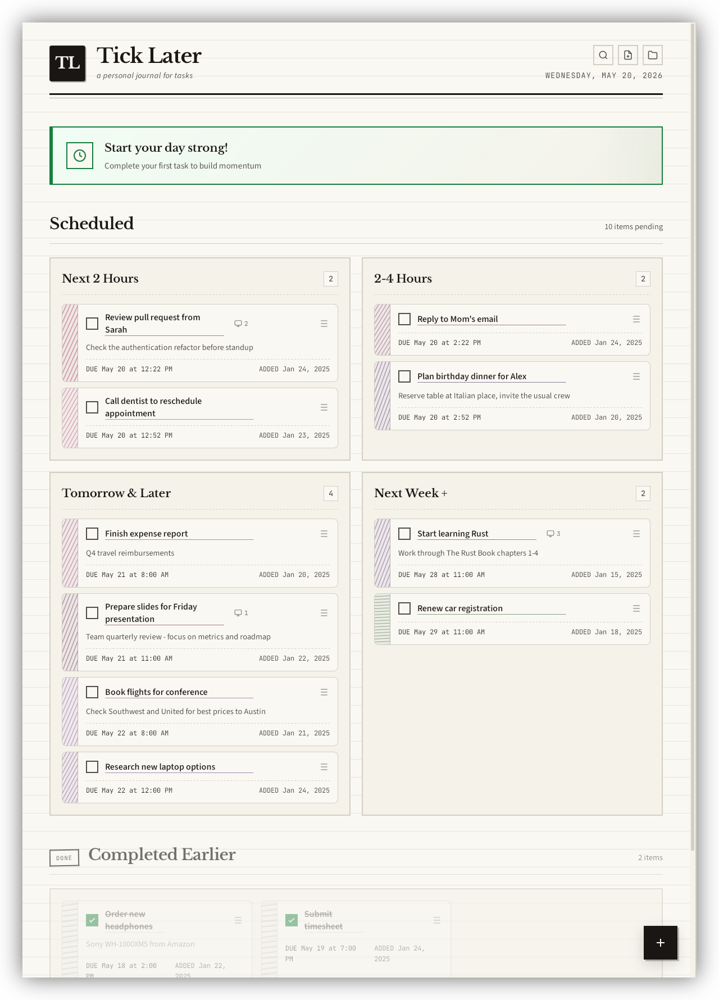

# Tick Later



A minimal, notebook-style desktop app for managing tasks with time-based scheduling.

Built with Tauri, Vue 3, and TypeScript.

## Features

- **Time-based organization** - Tasks are automatically sorted into time slots: Next 2 Hours, 2-4 Hours, Tomorrow, and Next Week
- **Drag and drop** - Reschedule tasks by dragging them between time slots
- **Quick scheduling** - Preset buttons for common scheduling patterns
- **Integrated terminal** - Open a terminal session for any task to run commands in context
- **Virtual desktop pinning** - Associate tasks with virtual desktops and switch to them with one click (Linux only)
- **Clickable URLs** - Links in task titles and notes open in your default browser
- **Notebook aesthetic** - Clean, paper-like design with a focus on readability
- **Local storage** - All data stored locally on your machine

## Installation

Download the latest release for your platform from the [Releases page](https://github.com/elektronenhirn/tick-later/releases).

| Platform | File |
|----------|------|
| Windows | `.msi` or `.exe` |
| macOS (Apple Silicon) | `.dmg` (aarch64) |
| macOS (Intel) | `.dmg` (x86_64) |
| Linux | `.deb` or `.AppImage` |

### macOS: "App is damaged" warning

macOS may show a warning that "tick-later is damaged and can't be opened" when you try to run the app. This happens because the app is not signed with an Apple Developer certificate.

**To fix this**, open Terminal and run:

```bash
xattr -cr /Applications/tick-later.app
```

Or if you haven't moved it to Applications yet:

```bash
xattr -cr ~/Downloads/tick-later.app
```

This removes the quarantine flag that macOS adds to downloaded files.

## Development

### Prerequisites

- [Node.js](https://nodejs.org/) (v18 or later)
- [Rust](https://www.rust-lang.org/tools/install)
- [Tauri CLI](https://tauri.app/v1/guides/getting-started/prerequisites)

### Setup

```bash
# Install dependencies
npm install

# Run in development mode
npm run tauri dev

# Build for production
npm run tauri build
```

### Tech Stack

- **Frontend**: Vue 3 + TypeScript + Vite
- **Backend**: Rust + Tauri
- **Styling**: Scoped CSS with CSS variables

### End-to-End Testing

The project includes E2E tests using [WebDriverIO](https://webdriver.io/) with the Tauri WebDriver.

#### Prerequisites

Install the Tauri driver (required for WebDriver communication with the Tauri app):

```bash
cargo install tauri-driver
```

On Linux, you also need WebKitWebDriver:

```bash
# Ubuntu/Debian
sudo apt install webkit2gtk-driver
```

#### Running E2E Tests

```bash
npm run test:e2e
```

This command will:
1. Build the Rust backend (debug mode)
2. Start the Vite development server
3. Launch `tauri-driver` to bridge WebDriver commands
4. Run the test suite against the Tauri application

#### How It Works

- Tests use WebDriverIO to interact with the app through the WebDriver protocol
- Each test run creates an isolated temporary database in `/tmp/` to avoid affecting your real data
- The temp database is automatically cleaned up after tests complete
- Tests verify UI interactions like creating todos, marking them complete, and moving between sections

#### Test Files

- `wdio.conf.ts` - WebDriverIO configuration
- `tests/e2e/` - E2E test specifications

## Recommended IDE Setup

- [VS Code](https://code.visualstudio.com/)
- [Vue - Official](https://marketplace.visualstudio.com/items?itemName=Vue.volar)
- [Tauri](https://marketplace.visualstudio.com/items?itemName=tauri-apps.tauri-vscode)
- [rust-analyzer](https://marketplace.visualstudio.com/items?itemName=rust-lang.rust-analyzer)

## License

MIT
